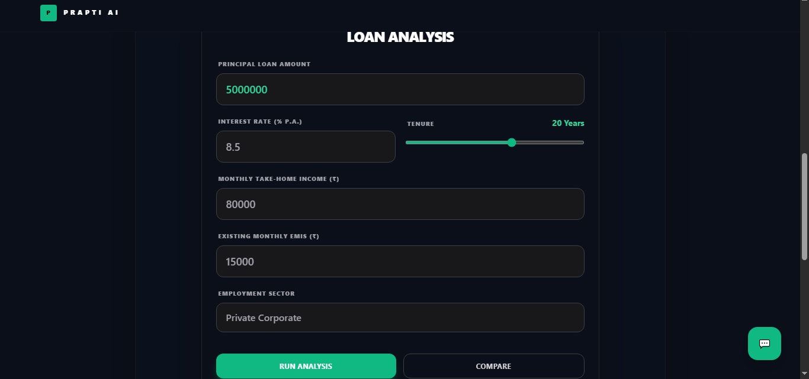
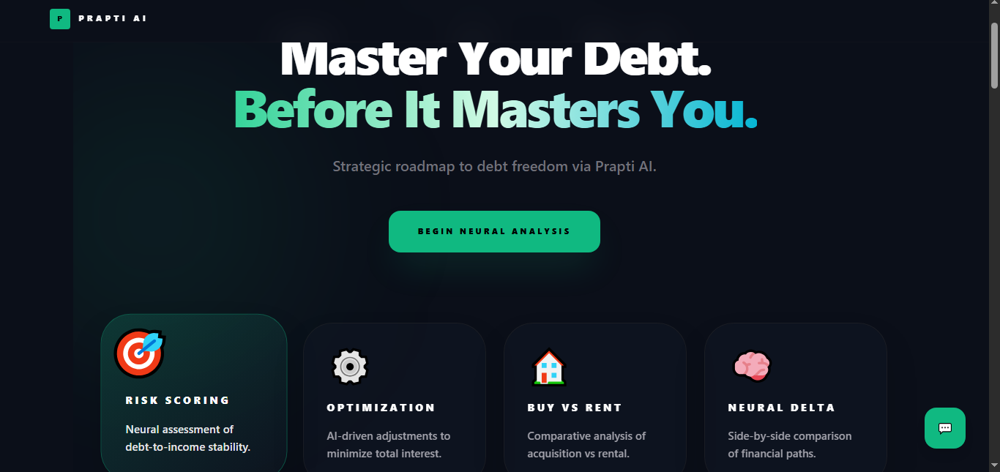
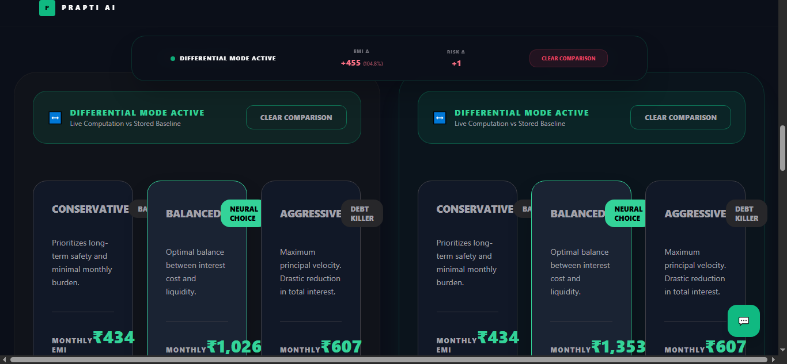

# 🏦 Prapti AI — Neural Financial Resilience Engine

> **An intelligent financial optimization platform designed to eliminate debt strategically using data-driven simulations and adaptive risk modeling.**

---

## 📌 Overview

**Prapti AI** is a full-stack financial intelligence system that helps users make optimal repayment decisions by simulating multiple debt strategies. It transforms raw financial inputs into actionable insights using a custom-built mathematical engine.

The platform focuses on:

* Minimizing **total interest paid**
* Maintaining **healthy liquidity**
* Adapting to **real-world job stability scenarios**

---

## 🚨 Problem Statement

Modern debt management systems fail due to rigid and generic approaches:

* ❌ **Interest Accumulation Blindness** — Users underestimate long-term interest impact
* ❌ **Static EMI Structures** — No adaptability to income variability
* ❌ **Liquidity Mismanagement** — Overpaying loans at the cost of financial safety

---

## 💡 Solution

Prapti AI introduces a **Neural Financial Engine** that simulates multiple repayment strategies and identifies the most efficient path.

### Core Capabilities

* 🧠 **Neural Risk Scoring**
  Calculates a real-time financial risk score based on DTI ratio, income, and job stability

* ⚖️ **Strategy Simulation Engine**
  Compares multiple repayment approaches:

  * Conservative (Safe)
  * Balanced (Optimal)
  * Aggressive (Fast Debt Clearance)

* 📉 **Interest Optimization Engine**
  Determines the tenure and EMI combination that minimizes interest outflow

---

## ✨ Features

### 🖥️ Neural Analysis Dashboard

* Real-time risk score (0–100)
* Monthly financial burn visualization
* Strategy comparison insights

### 🎯 Multi-Strategy Modeling

* Toggle between repayment styles
* Visual comparison of savings and risk

### 🛡️ Employment Stability Scaling

* Government (High Stability)
* Private (Moderate Stability)
* Gig Economy (Variable Stability)

### 🌙 Modern UI/UX

* Dark-themed “Neural UI”
* Smooth animations using Framer Motion
* Clean, responsive layout with Tailwind CSS

---

## 🖼️ Screenshots

### 🏠 Input Dashboard



### 📊 Analysis Dashboard



### 📈 Strategy Comparison




---

## 🧠 System Architecture

### 🔹 Frontend

* **React (Vite)** — Fast UI rendering
* **Tailwind CSS** — Utility-first styling
* **Framer Motion** — Interactive animations

### 🔹 Backend

* **Node.js** — Runtime environment
* **Express.js** — API layer
* **Custom Financial Engine** — Core logic for calculations

---

## 📂 Project Structure

```
Prapti-AI/
├── frontend/          # React UI Components
├── backend/           # Express API & Logic
├── screenshots/       # UI Images
├── .env.example       # Environment variables template
└── README.md
```

---

## ⚙️ Installation & Setup

### 🔹 Prerequisites

Ensure the following are installed:

* Node.js (v16 or higher)
* npm or yarn
* Git

---

### 🔹 Clone Repository

```bash
git clone https://github.com/KanishkGarg04/Prapti-AI.git
cd Prapti-AI
```

---

### 🔹 Backend Setup

```bash
cd backend
npm install
npm start
```

Backend will run on:

```
http://localhost:5000
```

---

### 🔹 Frontend Setup

```bash
cd frontend
npm install
npm run dev
```

Frontend will run on:

```
http://localhost:5173
```

---

## 🌐 Environment Variables

Create a `.env` file in the backend directory:

```
PORT=5000
```

(Extend as needed for future integrations)

---

## 🧪 Core Logic (Conceptual Flow)

```
User Input → Neural Engine → Strategy Simulation → Risk Scoring → Output Dashboard
```

### Key Parameters Used:

* Debt-to-Income Ratio (DTI)
* Interest Rate (ROI)
* Monthly Income
* Employment Stability Multiplier
* Liquidity Buffer

---

## 📊 Mathematical Engine

The system evaluates financial resilience using a weighted model:

* **DTI Ratio** → Debt pressure
* **Stability Score** → Income reliability
* **Liquidity Buffer** → Remaining cash flow

These combine to produce a **Resilience Score (0–100)**.

---

## 🚀 Future Scope

* 🔗 Bank API Integration (Real-time data)
* 📱 Mobile App Version
* 🤖 AI Chat Assistant for financial guidance
* 📊 Investment Reallocation Engine

---

## 🧾 Conclusion

Prapti AI redefines debt management by transforming static financial decisions into dynamic, data-driven strategies. By combining intelligent risk analysis with adaptive repayment modeling, it empowers users to make financially resilient choices with confidence.

As financial ecosystems evolve, Prapti AI aims to become a foundational tool for intelligent capital management and long-term financial stability.

