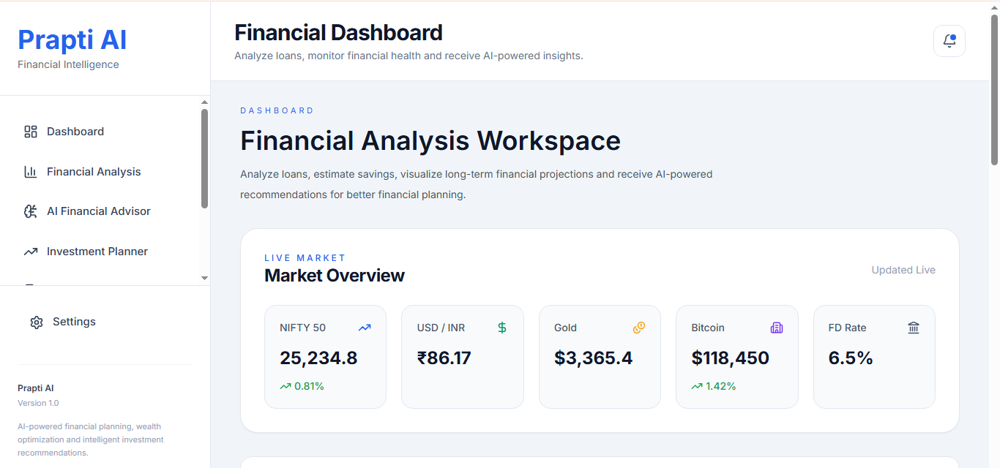
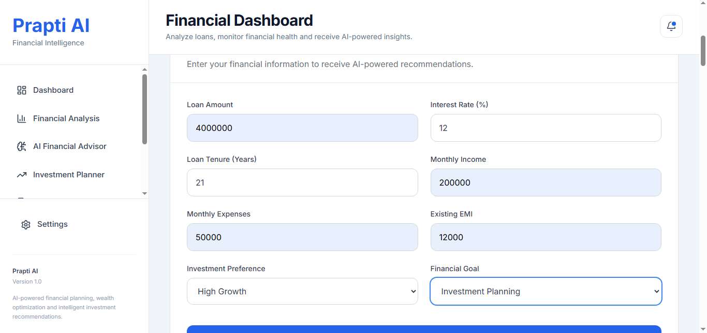
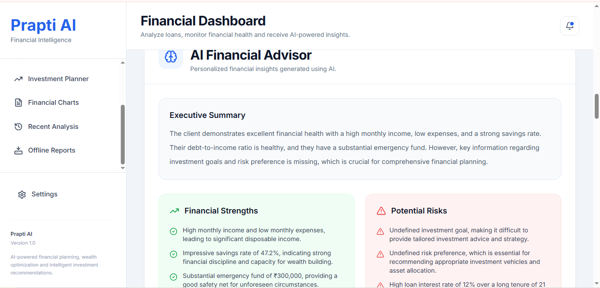
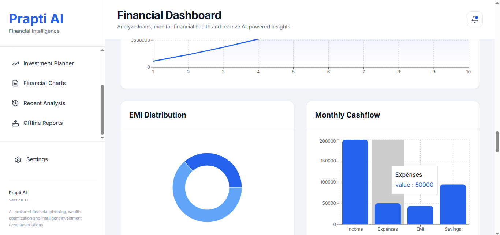
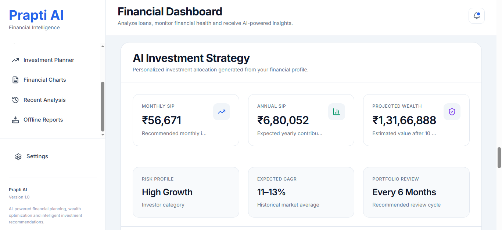
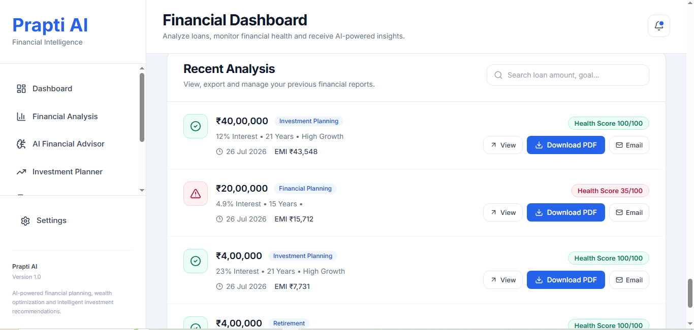
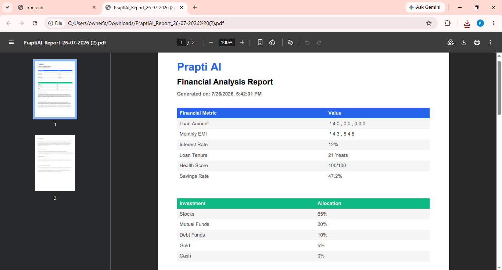
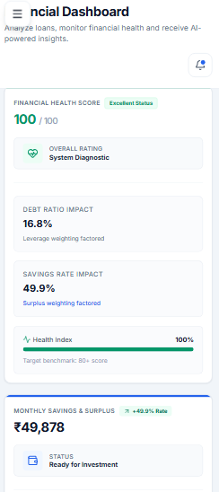

# 💰 Prapti AI — AI-Powered Financial Intelligence Platform

<p align="center">


</p>

<p align="center">

AI-powered financial planning platform that helps users analyze loans, evaluate financial health, receive personalized AI recommendations, plan investments, monitor live market data, and generate professional financial reports.

</p>

--

## ✨ Features

### 🤖 AI Financial Advisor

- Personalized financial analysis using OpenRouter AI
- Executive financial summary
- Financial strengths
- Potential risks
- Actionable recommendations
- Investment advice
- Loan optimization suggestions

---

### 📊 Financial Analysis

- Loan EMI calculation
- Debt-to-Income Ratio
- Savings Rate
- Emergency Fund Estimation
- Financial Health Score
- Monthly cash-flow analysis

---

### 📈 Investment Planning

- Asset allocation recommendation
- Stocks
- Mutual Funds
- Debt Funds
- Gold
- Cash allocation

---

### 📉 Live Market Dashboard

Real-time financial market updates including

- 📈 NIFTY 50
- 📉 SENSEX
- 💵 USD/INR
- 🪙 Gold Prices
- 📊 Market Trends

---

### 📄 Professional Reports

Generate professional financial reports with

- Loan Summary
- Financial Metrics
- Investment Allocation
- AI Recommendations
- Executive Summary
- Financial Risk Analysis

Export reports as beautifully formatted PDFs.

---

### 📂 Offline Report Storage

Downloaded reports are automatically stored locally using IndexedDB.

Users can

- Open reports offline
- Manage downloaded reports
- Delete reports
- Access reports without internet

---

### 📧 Email Reports

Share generated reports directly through email.

---

### 📱 Fully Responsive

Optimized for

- Desktop
- Laptop
- Tablet
- Mobile Devices

---

### 🔒 Authentication

- JWT Authentication
- Protected Routes
- Secure Login
- Secure Signup

---

# 📸 Screenshots

---

## Live Market Overview



---

## Financial Analysis



---

## AI Financial Advisor



---

## Financial Charts



---

## Investment Planning



---

## Professional Report



---

## Offline Reports



---

## Mobile Responsive



---

# 🏗 System Architecture

```
                React + Vite

                     │

         Axios REST API Calls

                     │

              Express.js API

                     │

        ┌────────────┴────────────┐

 Authentication             Analysis Engine

        │                         │

 JWT Middleware        Financial Calculator

                                  │

                           OpenRouter AI

                                  │

                            AI Recommendation

                                  │

                             MongoDB Atlas

```

---

# 🧠 AI Workflow

```
User Input

      ↓

Financial Calculations

      ↓

Debt Ratio

Savings Rate

Health Score

Emergency Fund

EMI

      ↓

OpenRouter AI

      ↓

Executive Summary

Strengths

Risks

Actions

Investment Advice

Loan Advice

      ↓

Professional Report

```

---

# 🛠 Tech Stack

## Frontend

- React.js
- Vite
- Tailwind CSS
- Framer Motion
- React Router
- Axios
- Lucide React
- IndexedDB

---

## Backend

- Node.js
- Express.js
- MongoDB Atlas
- JWT Authentication
- OpenRouter API
- Nodemailer

---

## AI

- OpenRouter API

---

## Charts

- Recharts

---

## PDF

- jsPDF

---

## Database

- MongoDB Atlas

---

# 📂 Project Structure

```
Prapti-AI

├── frontend

│ ├── components

│ ├── pages

│ ├── context

│ ├── services

│ └── utils

│

├── backend

│ ├── controllers

│ ├── models

│ ├── routes

│ ├── middleware

│ ├── services

│ └── config

│

└── README
```

---

# ⚙ Installation

## Clone

```bash
git clone https://github.com/yourusername/prapti-ai.git
```

---

## Frontend

```bash
cd frontend

npm install

npm run dev
```

---

## Backend

```bash
cd backend

npm install

npm run dev
```

---

# 🔑 Environment Variables

Backend

```
PORT=

MONGO_URI=

JWT_SECRET=

OPENROUTER_API_KEY=

EMAIL_USER=

EMAIL_PASS=
```

---

Frontend

```
VITE_API_URL=
```

---

# API Endpoints

## Authentication

```
POST /api/auth/signup

POST /api/auth/login
```

---

## Analysis

```
POST /api/analysis

GET /api/analysis/history

GET /api/analysis/:id

POST /api/analysis/email
```

---

## Market

```
GET /api/market/live
```

---

## Chat Assistant

```
POST /api/chat
```

---

# Security Features

- JWT Authentication
- Protected APIs
- User-specific Reports
- Secure Password Hashing
- Environment Variable Protection

---

# Performance Features

- Responsive Design
- Lazy Rendering
- IndexedDB Offline Storage
- Axios Interceptors
- Compression Middleware
- Helmet Security
- Optimized API Calls

---

# Future Improvements

- 📱 Progressive Web App (PWA)
- 🔔 Financial Alerts
- 📅 EMI Calendar
- 📈 Portfolio Tracking
- 💳 Credit Score Prediction
- 🧾 Tax Planning
- 🎯 Goal Tracking
- 📊 Advanced Financial Analytics
- 🤖 Voice-enabled AI Assistant

---

# 👨‍💻 Author

**Kanishka Garg**

---

# ⭐ Support

If you found this project helpful,

please consider giving it a ⭐ on GitHub.